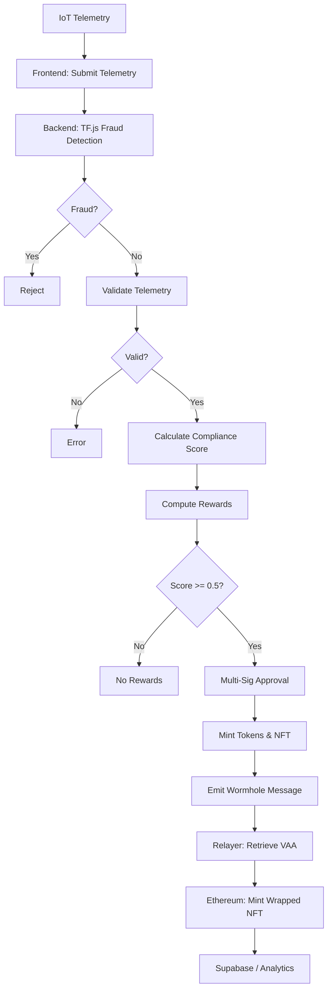

# Polymers Protocol Rewards System

**⚠️ Disclaimer: Sample / Untested Implementation**  
This is a demo AI-driven rewards platform on Solana. The code, including AI compliance scoring, token/NFT minting, Wormhole cross-chain bridging, relayer automation, TensorFlow.js fraud detection, frontend dashboard, and backend API, is illustrative and **untested**. Do not deploy on mainnet without thorough testing, validation, and professional security audits. Use at your own risk.

## Overview

Polymers Protocol is a multi-tenant, AI-driven Solana program for minting **PLY**, **CARB**, **EWASTE** tokens, and **ESG NFTs** based on IoT telemetry and ESG metrics. It features:
- **AI-Driven Compliance Scoring**: Evaluates telemetry (e.g., contamination, temperature) using fixed-point math (~3,000 CUs).
- **Fraud Detection**: TensorFlow.js autoencoder flags anomalies (e.g., fake weights) in backend API and frontend dashboard.
- **Multi-Tenant Support**: Partner-specific multipliers and thresholds.
- **Multi-Sig Governance**: Requires ≥2 admin approvals via Squads.
- **Cross-Chain Bridging**: Automates ESG NFT bridging to Ethereum via Wormhole with a relayer toolkit.
- **Frontend Dashboard**: React-based UI for telemetry submission, fraud visualization, and NFT tracking.
- **Backend API**: Node.js endpoint for telemetry processing, fraud detection, and Solana/Ethereum interactions.
- **Real-Time Analytics**: Supabase logs for Grafana dashboards.
- **Optimizations**: Bitwise validation, reduced accounts, and batched CPIs to stay under 1.4M CU limit.

---

## Directory Structure

```
/programs/src
├── lib.rs              # Program entry point
├── errors.rs           # Custom errors (InvalidTelemetry, LowComplianceScore)
├── state.rs            # Structs (RewardVault, BatchDeposit, EsgMetrics)
├── instructions/
│   ├── mod.rs
│   ├── initialize.rs   # Initializes RewardVault
│   ├── approve_mint.rs # Multi-sig approvals
│   ├── mint_rewards.rs # Mints PLY, CARB, EWASTE
│   └── mint_nft.rs     # Mints ESG NFTs, emits Wormhole messages
/tests
├── integration.rs      # Anchor tests
/api
├── rewards
│   └── deposit.js      # Telemetry submission endpoint with TF.js fraud detection
/frontend
├── src/
│   ├── App.jsx         # Main React app
│   ├── components/
│   │   ├── TelemetryForm.jsx # Telemetry input form
│   │   ├── FraudViz.jsx      # TF.js fraud visualization
│   │   └── NftTracker.jsx    # NFT mint/bridge status
│   ├── models/
│   │   └── autoencoder.js    # TF.js fraud detection model
├── public/
├── package.json
/relayer
├── relayer.ts          # Wormhole relayer for VAA automation
├── test.ts             # Expanded test suite
├── test/
│   ├── helpers.ts      # Test utilities
│   ├── data/
│   │   ├── valid.json  # Valid test inputs
│   │   └── invalid.json # Invalid test inputs
/Anchor.toml
/Cargo.toml
/.env
/README.md
```

---

## Features

- **AI Compliance Scoring**: Validates telemetry and computes scores efficiently (~3,000 CUs).
- **Fraud Detection**: TensorFlow.js autoencoder flags anomalies in backend API and frontend dashboard (~50ms inference).
- **Token Minting**: Mints PLY, CARB, EWASTE based on compliance scores.
- **ESG NFT Bridging**: Mints NFTs on Solana (Metaplex) and automates Ethereum bridging via Wormhole (~8,000 CUs).
- **Multi-Sig Governance**: Optimized Squads-based approvals with batch processing.
- **Frontend Dashboard**: Real-time telemetry input, fraud visualization, and NFT status tracking.
- **Backend API**: Handles telemetry validation, fraud detection, and Solana/Ethereum interactions.
- **Analytics**: Supabase logs for Grafana visualization and Sentry/Slack alerts.
- **Relayer Toolkit**: Automates telemetry submission, NFT minting, VAA retrieval, and Ethereum minting.
- **Optimizations**: Fixed-point arithmetic, bitwise validation, reduced accounts, and batched CPIs.

---

## Prerequisites

- **Rust**: ≥1.68
- **Solana CLI**: ≥1.18
- **Anchor CLI**: ≥0.31.1
- **Node.js**: ≥20
- **Hardhat**: For Ethereum deployment
- **Wormhole SDK**: For relayer and bridging
- **Supabase CLI**: For analytics
- **Mocha/Chai**: For relayer and API tests
- **TensorFlow.js**: For fraud detection
- **React/Vite**: For frontend dashboard
- **Recharts**: For fraud visualization

Install:
```bash
curl --proto '=https' --tlsv1.2 -sSf https://sh.rustup.rs | sh
solana-install init 1.18.0
cargo install --git https://github.com/coral-xyz/anchor anchor-cli --locked
npm install -g @supabase/supabase-js hardhat yarn
yarn add @wormhole-foundation/sdk ethers axios typescript ts-node mocha chai @tensorflow/tfjs-node react react-dom @supabase/supabase-js recharts
yarn add -D vite @vitejs/plugin-react
```

---

## Environment Setup

1. **Clone Repository**:
   ```bash
   git clone https://github.com/PolymersNetwork/polymers-rewards.git
   cd polymers-rewards
   yarn install
   ```

2. **Configure `.env`**:
   ```bash
   SOLANA_WALLET='[wallet_keypair]'
   PROGRAM_ID='YourSolanaProgramIdHere'
   WORMHOLE_PROGRAM='worm2ZoG2kUd4vFXhvjh5UUAA9nV4fV3nq3b3U8f8'
   PLY_MINT='PLYKdaCUgxTUw6rSjWbgSN97Qtecb6Fy6SazWf1tvAC'
   CARB_MINT='[carb_mint_address]'
   EWASTE_MINT='[ewaste_mint_address]'
   NFT_MINT='[nft_mint_address]'
   ETHEREUM_WORMHOLE='0x98f3c9e6E3fAce36bAAd05FE09d375Ef1464288B'
   ETHEREUM_RPC='https://sepolia.infura.io/v3/YOUR_INFURA_KEY'
   WALLET_PRIVATE_KEY='your_ethereum_wallet_private_key'
   GUARDIAN_RPC='https://guardian-mainnet.wormhole.com'
   SUPABASE_URL='[supabase_url]'
   SUPABASE_KEY='[supabase_key]'
   API_URL='http://localhost:3000/api/rewards/deposit'
   VITE_API_URL='http://localhost:3000/api/rewards/deposit'
   VITE_SUPABASE_URL='[supabase_url]'
   VITE_SUPABASE_KEY='[supabase_key]'
   ```

3. **Preflight Checks**:
   ```bash
   solana config get
   solana balance
   anchor --version
   node -v
   npx hardhat --version
   yarn mocha --version
   node -e "require('@tensorflow/tfjs-node')"
   yarn vite --version
   ```

---

## Deployment

### Solana Deployment
1. **Build Program**:
   ```bash
   anchor build
   ```

2. **Start Local Validator** (for testing):
   ```bash
   solana-test-validator &
   ```

3. **Deploy to Devnet**:
   ```bash
   anchor deploy --provider.cluster devnet
   anchor idl init --filepath target/idl/polymers_rewards.json $PROGRAM_ID --provider.cluster devnet
   ```

4. **Initialize Reward Vault**:
   ```bash
   anchor run initialize --args reward_amount:1000
   ```

### Ethereum Deployment (Wormhole)
Deploy `WrappedEsgNFT.sol`:
```javascript
// scripts/deploy.js
const { ethers } = require("hardhat");

async function main() {
  const WrappedEsgNFT = await ethers.getContractFactory("WrappedEsgNFT");
  const contract = await WrappedEsgNFT.deploy(process.env.ETHEREUM_WORMHOLE);
  await contract.deployed();
  console.log("WrappedEsgNFT deployed to:", contract.address);
}

main();
```
Run:
```bash
npx hardhat run scripts/deploy.js --network sepolia
```

Verify:
```bash
npx hardhat console --network sepolia
> const contract = await ethers.getContractAt("WrappedEsgNFT", "DEPLOYED_ADDRESS")
```

### Backend API Deployment
1. **Setup**:
   ```bash
   cd api
   yarn add express @tensorflow/tfjs-node axios @supabase/supabase-js express-rate-limit
   ```

2. **Run API**:
   ```bash
   node rewards/deposit.js
   ```

3. **Deploy** (e.g., Vercel):
   - Configure `vercel.json`:
     ```json
     {
       "version": 2,
       "builds": [{ "src": "rewards/deposit.js", "use": "@vercel/node" }],
       "routes": [{ "src": "/api/rewards/deposit", "dest": "rewards/deposit.js" }]
     }
     ```
   - Run: `vercel deploy`.

### Frontend Dashboard Deployment
1. **Setup**:
   ```bash
   cd frontend
   yarn add react react-dom @supabase/supabase-js @tensorflow/tfjs axios recharts
   yarn add -D vite @vitejs/plugin-react
   ```

2. **Run Locally**:
   ```bash
   yarn dev
   ```

3. **Deploy** (e.g., Netlify):
   - Build: `yarn build`
   - Deploy: `netlify deploy --prod`

### Relayer Deployment
1. **Setup**:
   ```bash
   cd relayer
   yarn install
   ```

2. **Run Relayer**:
   ```bash
   yarn start
   ```

3. **Deploy** (e.g., AWS Lambda):
   - Package: `zip -r relayer.zip .`
   - Deploy via AWS CLI: `aws lambda update-function-code --function-name PolymersRelayer --zip-file fileb://relayer.zip`

---

## Backend Documentation

### Overview
The backend is a Node.js API (`/api/rewards/deposit`) that:
- Validates IoT telemetry (e.g., `amount <= 1_000_000`).
- Runs TensorFlow.js autoencoder for fraud detection (~50ms inference).
- Submits valid telemetry to the Solana program (`mint_nft.rs`) via Anchor SDK.
- Triggers the Wormhole relayer for VAA retrieval and Ethereum bridging.
- Logs telemetry, fraud scores, and errors to Supabase (`telemetry_logs`, `fraud_logs`, `errors`).

### API Endpoint
**`POST /api/rewards/deposit`**:
- **Input**: Telemetry JSON (e.g., `{ "amount": 1000, "contamination": 5, ... }`).
- **Processing**:
  - Validates inputs (e.g., `Number.isFinite(telemetry.amount)`).
  - Runs TF.js autoencoder (MSE > 0.15 flags fraud).
  - Submits to Solana program.
  - Logs to Supabase.
- **Output**: `{ deposit_id: "xyz" }` or `{ error: "Fraud detected" }`.

**Example Code** (`api/rewards/deposit.js`):
```javascript
const express = require('express');
const tf = require('@tensorflow/tfjs-node');
const axios = require('axios');
const { createClient } = require('@supabase/supabase-js');
const rateLimit = require('express-rate-limit');

const app = express();
app.use(express.json());
app.use(rateLimit({ windowMs: 24 * 60 * 60 * 1000, max: 100 })); // 100/day
app.use((req, res, next) => {
  res.header('Access-Control-Allow-Origin', 'http://localhost:5173');
  res.header('Access-Control-Allow-Headers', 'Content-Type');
  next();
});

const supabase = createClient(process.env.SUPABASE_URL, process.env.SUPABASE_KEY);
const autoencoder = tf.loadLayersModel('file://./models/autoencoder.json');
const threshold = 0.15;

function validateTelemetry(telemetry) {
  return (
    Number.isFinite(telemetry.amount) &&
    telemetry.amount > 0 &&
    telemetry.amount <= 1_000_000 &&
    Number.isFinite(telemetry.contamination) &&
    Number.isFinite(telemetry.temperature) &&
    Number.isFinite(telemetry.carbon_offset) &&
    Number.isFinite(telemetry.recyclability)
  );
}

function normalizeTelemetry(telemetry) {
  const values = [
    telemetry.amount,
    telemetry.contamination,
    telemetry.temperature,
    telemetry.carbon_offset,
    telemetry.recyclability
  ];
  const tensor = tf.tensor2d([values], [1, 5]);
  const { mean, variance } = tf.moments(tensor, 0);
  return tensor.sub(mean).div(variance.sqrt());
}

function computeMSE(model, input) {
  const reconstructed = model.predict(input);
  return tf.mean(tf.pow(input.sub(reconstructed), 2)).dataSync()[0];
}

app.post('/api/rewards/deposit', async (req, res) => {
  const telemetry = req.body;
  if (!validateTelemetry(telemetry)) {
    await supabase.from('errors').insert({ error: 'Invalid telemetry' });
    return res.status(400).json({ error: 'Invalid telemetry' });
  }
  const normalized = normalizeTelemetry(telemetry);
  const mse = computeMSE(await autoencoder, normalized);
  if (mse > threshold) {
    await supabase.from('fraud_logs').insert({ telemetry, mse, flagged: true });
    return res.status(400).json({ error: 'Fraud detected' });
  }
  try {
    const response = await axios.post('http://polymers-program:8080/mint', telemetry); // Mock Solana endpoint
    await supabase.from('telemetry_logs').insert({ ...telemetry, deposit_id: response.data.deposit_id });
    res.json({ deposit_id: response.data.deposit_id });
  } catch (error) {
    await supabase.from('errors').insert({ error: 'Telemetry submission', details: error.message });
    res.status(500).json({ error: error.message });
  }
});

app.listen(3000, () => console.log('API running on port 3000'));
```

### Integration
- **Solana**: Uses Anchor SDK to call `mint_nft.rs` for token/NFT minting.
- **Wormhole**: Triggers relayer for VAA retrieval and Ethereum submission (`WrappedEsgNFT.sol`).
- **Supabase**: Logs to `telemetry_logs`, `fraud_logs`, `errors` tables with RLS.

### Security
- **Rate Limiting**: Caps at 100 requests/day using `express-rate-limit`.
- **CORS**: Restricts to `http://localhost:5173`.
- **Input Sanitization**: Validates numeric fields.
- **Model Integrity**: Verifies TF.js model weights hash.

---

## Frontend Documentation

### Overview
The frontend is a React-based dashboard (built with Vite) that:
- Submits IoT telemetry via `TelemetryForm.jsx` to `/api/rewards/deposit`.
- Visualizes fraud detection results using TensorFlow.js and Recharts in `FraudViz.jsx`.
- Tracks NFT minting and bridging status in `NftTracker.jsx` using Supabase subscriptions.
- Queries Supabase for real-time analytics (e.g., compliance scores, fraud logs).

### Setup
1. **Install Dependencies**:
   ```bash
   cd frontend
   yarn add react react-dom @supabase/supabase-js @tensorflow/tfjs axios recharts
   yarn add -D vite @vitejs/plugin-react
   ```

2. **Configure Vite** (`frontend/vite.config.js`):
   ```javascript
   import { defineConfig } from 'vite';
   import react from '@vitejs/plugin-react';

   export default defineConfig({
     plugins: [react()],
     server: { port: 5173 },
   });
   ```

3. **Run Dashboard**:
   ```bash
   yarn dev
   ```

### Components
- **TelemetryForm.jsx**: Form for submitting telemetry inputs.
- **FraudViz.jsx**: Visualizes fraud scores (MSE) with Recharts (red for MSE > 0.15).
- **NftTracker.jsx**: Displays Solana NFT mints and Ethereum bridging status via Supabase.

**Example Code** (`frontend/src/App.jsx`):
```jsx
import { useState } from 'react';
import { createClient } from '@supabase/supabase-js';
import axios from 'axios';
import * as tf from '@tensorflow/tfjs';
import TelemetryForm from './components/TelemetryForm';
import FraudViz from './components/FraudViz';
import NftTracker from './components/NftTracker';

const supabase = createClient(import.meta.env.VITE_SUPABASE_URL, import.meta.env.VITE_SUPABASE_KEY);

function App() {
  const [telemetry, setTelemetry] = useState(null);
  const [fraudScore, setFraudScore] = useState(null);

  const handleSubmit = async (data) => {
    if (!validateTelemetry(data)) {
      await supabase.from('errors').insert({ error: 'Invalid telemetry' });
      return alert('Invalid telemetry');
    }
    const normalized = normalizeTelemetry(data);
    const autoencoder = await tf.loadLayersModel('/models/autoencoder.json');
    const mse = computeMSE(autoencoder, normalized);
    setFraudScore(mse);
    if (mse > 0.15) {
      await supabase.from('fraud_logs').insert({ telemetry: data, mse, flagged: true });
      return alert('Fraud detected!');
    }
    try {
      const response = await axios.post(import.meta.env.VITE_API_URL, data);
      setTelemetry(response.data);
      await supabase.from('telemetry_logs').insert({ ...data, deposit_id: response.data.deposit_id });
    } catch (error) {
      await supabase.from('errors').insert({ error: 'Telemetry submission', details: error.message });
      alert('Submission failed');
    }
  };

  function validateTelemetry(data) {
    return Object.values(data).every(val => Number.isFinite(val) && val >= 0);
  }

  function normalizeTelemetry(data) {
    const values = Object.values(data);
    const tensor = tf.tensor2d([values], [1, values.length]);
    const { mean, variance } = tf.moments(tensor, 0);
    return tensor.sub(mean).div(variance.sqrt());
  }

  function computeMSE(model, input) {
    const reconstructed = model.predict(input);
    return tf.mean(tf.pow(input.sub(reconstructed), 2)).dataSync()[0];
  }

  return (
    <div>
      <h1>Polymers Rewards Dashboard</h1>
      <TelemetryForm onSubmit={handleSubmit} />
      <FraudViz score={fraudScore} />
      <NftTracker telemetry={telemetry} />
    </div>
  );
}

export default App;
```

**`frontend/src/components/TelemetryForm.jsx`**:
```jsx
import { useState } from 'react';

function TelemetryForm({ onSubmit }) {
  const [formData, setFormData] = useState({
    amount: '', contamination: '', temperature: '', carbon_offset: '', recyclability: ''
  });

  const handleChange = (e) => {
    setFormData({ ...formData, [e.target.name]: parseFloat(e.target.value) });
  };

  const handleSubmit = (e) => {
    e.preventDefault();
    onSubmit(formData);
  };

  return (
    <form onSubmit={handleSubmit}>
      <input type="number" name="amount" placeholder="Amount" onChange={handleChange} required />
      <input type="number" name="contamination" placeholder="Contamination" onChange={handleChange} required />
      <input type="number" name="temperature" placeholder="Temperature" onChange={handleChange} required />
      <input type="number" name="carbon_offset" placeholder="Carbon Offset" onChange={handleChange} required />
      <input type="number" name="recyclability" placeholder="Recyclability" onChange={handleChange} required />
      <button type="submit">Submit Telemetry</button>
    </form>
  );
}

export default TelemetryForm;
```

**`frontend/src/components/FraudViz.jsx`**:
```jsx
import { LineChart, Line, XAxis, YAxis } from 'recharts';

function FraudViz({ score }) {
  const data = [{ name: 'Fraud Score', mse: score || 0 }];
  return (
    <div>
      <h2>Fraud Detection</h2>
      <LineChart width={400} height={200} data={data}>
        <Line type="monotone" dataKey="mse" stroke={score > 0.15 ? '#ff0000' : '#00ff00'} />
        <XAxis dataKey="name" />
        <YAxis />
      </LineChart>
    </div>
  );
}

export default FraudViz;
```

**`frontend/src/components/NftTracker.jsx`**:
```jsx
import { useEffect, useState } from 'react';
import { createClient } from '@supabase/supabase-js';

const supabase = createClient(import.meta.env.VITE_SUPABASE_URL, import.meta.env.VITE_SUPABASE_KEY);

function NftTracker({ telemetry }) {
  const [status, setStatus] = useState('Pending');

  useEffect(() => {
    if (telemetry?.deposit_id) {
      const subscription = supabase
        .channel('nft_bridges')
        .on('postgres_changes', { event: 'INSERT', schema: 'public', table: 'nft_bridges' }, (payload) => {
          if (payload.new.deposit_id === telemetry.deposit_id) {
            setStatus(`Bridged: ${payload.new.tx_hash}`);
          }
        })
        .subscribe();
      return () => supabase.removeChannel(subscription);
    }
  }, [telemetry]);

  return (
    <div>
      <h2>NFT Status</h2>
      <p>{status}</p>
    </div>
  );
}

export default NftTracker;
```

### Supabase Integration
- **Setup**: Create tables (`telemetry_logs`, `fraud_logs`, `nft_bridges`, `errors`) with RLS enabled.
- **Queries**: Fetch recent telemetry and fraud scores for visualization.
- **Real-Time**: Use Supabase subscriptions for NFT bridging updates in `NftTracker.jsx`.

### Security
- **XSS Prevention**: Use `parseFloat` for inputs; avoid `dangerouslySetInnerHTML`.
- **Supabase RLS**: Restrict data to authenticated users (e.g., `select * from telemetry_logs where user_id = auth.uid()`).
- **Model Loading**: Serve TF.js models from secure CDN with hash verification.

---

## AI Compliance Scoring & Fraud Detection

### Telemetry Validation
Optimized with bitwise flags (~2,000 CUs):
```rust
fn validate_telemetry(deposit: &BatchDeposit) -> Result<(), CustomError> {
    let mut flags: u8 = 0;
    flags |= if deposit.amount > 0 && deposit.amount <= 1_000_000 { 0 } else { 1 << 0 };
    flags |= if deposit.contamination <= deposit.contamination_threshold { 0 } else { 1 << 1 };
    match flags {
        0 => Ok(()),
        1 => Err(CustomError::InvalidAmount),
        _ => Err(CustomError::InvalidTelemetry),
    }
}
```

### Compliance Score Calculation
Fixed-point arithmetic (~3,000 CUs):
```rust
fn calculate_compliance_score(deposit: &BatchDeposit) -> u64 {
    const SCALE: u64 = 1_000_000;
    const W_CONTAMINATION: u64 = 200_000;
    let c_score = if deposit.contamination <= deposit.contamination_threshold { SCALE } else { 0 };
    (W_CONTAMINATION * c_score + /* ... */) / SCALE
}
```

### Reward Calculation
Fixed-point math (~2,000 CUs):
```rust
fn calculate_rewards(deposit: &BatchDeposit, compliance_score: u64) -> (u64, u64, u64) {
    const SCALE: u64 = 1_000_000;
    let ply = (deposit.amount * 10 * SCALE * deposit.ply_multiplier * compliance_score) / (SCALE * SCALE);
    // ... carb, ewaste
    (ply, carb, ewaste)
}
```

### NFT Bridging
Optimized Wormhole payload (~8,000 CUs):
```rust
fn emit_wormhole_message<'info>(ctx: &Context<MintEsgNft>, nft_mint: Pubkey, target_chain: u16, recipient: [u8;32], esg_metrics: &EsgMetrics, compliance_score: u64) -> Result<(), CustomError> {
    let mut payload = [0u8; 82];
    payload[0..2].copy_from_slice(&[0u8, 1u8]);
    payload[2..34].copy_from_slice(&nft_mint.to_bytes());
    payload[34..66].copy_from_slice(&recipient);
    payload[66..74].copy_from_slice(&esg_metrics.carbon_offset.to_le_bytes());
    payload[74..82].copy_from_slice(&esg_metrics.recyclability.to_le_bytes());
    wormhole::cpi::publish_message(CpiContext::new(ctx.accounts.wormhole_program.to_account_info(), /* ... */), 1, payload)?;
    Ok(())
}
```

### TensorFlow.js Fraud Detection
Detects telemetry fraud in backend and frontend:
```javascript
// frontend/src/models/autoencoder.js
const tf = require('@tensorflow/tfjs');

// Load model (assumes pre-trained)
const autoencoder = tf.loadLayersModel('file://./models/autoencoder.json');
const threshold = 0.15;

function normalizeTelemetry(telemetry) {
  const values = [
    telemetry.amount,
    telemetry.contamination,
    telemetry.temperature,
    telemetry.carbon_offset,
    telemetry.recyclability
  ];
  const tensor = tf.tensor2d([values], [1, 5]);
  const { mean, variance } = tf.moments(tensor, 0);
  return tensor.sub(mean).div(variance.sqrt());
}

function computeMSE(model, input) {
  const reconstructed = model.predict(input);
  return tf.mean(tf.pow(input.sub(reconstructed), 2)).dataSync()[0];
}

async function detectFraud(telemetry) {
  const normalized = normalizeTelemetry(telemetry);
  const mse = computeMSE(await autoencoder, normalized);
  return { mse, isFraud: mse > threshold };
}

// Training example (run separately)
async function trainAutoencoder() {
  const normalData = tf.randomNormal([1000, 5]);
  const { mean, variance } = tf.moments(normalData, 0);
  const normalizedNormal = normalData.sub(mean).div(variance.sqrt());

  const input = tf.input({ shape: [5] });
  const encoder = tf.layers.dense({ units: 32, activation: 'relu' }).apply(input);
  const latent = tf.layers.dense({ units: 2, activation: 'relu' }).apply(encoder);
  const decoder = tf.layers.dense({ units: 32, activation: 'relu' }).apply(latent);
  const output = tf.layers.dense({ units: 5, activation: 'sigmoid' }).apply(decoder);

  const autoencoder = tf.model({ inputs: input, outputs: output });
  autoencoder.compile({ optimizer: 'adam', loss: 'mse' });

  await autoencoder.fit(normalizedNormal, normalizedNormal, {
    epochs: 50,
    batchSize: 32,
    validationSplit: 0.2,
    callbacks: tf.callbacks.earlyStopping({ monitor: 'val_loss', patience: 5 })
  });
  await autoencoder.save('file://./models/autoencoder');
}
```

---

## Example Inputs

**Telemetry**:
```json
{
  "amount": 1000,
  "contamination": 5,
  "temperature": 25,
  "carbon_offset": 50,
  "recyclability": 80
}
```

**Fraudulent Telemetry**:
```json
{
  "amount": 2000000,
  "contamination": 50,
  "temperature": -10,
  "carbon_offset": 0,
  "recyclability": 20000
}
```

**NFT Minting**:
```json
{
  "target_chain": 2,
  "recipient": "0xAbc1234567890123456789012345678901234567",
  "metadata_uri": "https://example.com/nft_metadata.json"
}
```

---

## Testing

1. **Local Validator**:
   ```bash
   solana-test-validator &
   ```

2. **API Server**:
   ```bash
   cd api && node rewards/deposit.js
   ```

3. **Frontend Dashboard**:
   ```bash
   cd frontend && yarn dev
   ```

4. **Anchor Tests**:
   ```bash
   anchor test
   ```

5. **Relayer Tests**:
   ```bash
   cd relayer && yarn test
   ```

6. **Scenarios**:
   - **Valid Workflow**: Submits telemetry, passes fraud detection, mints NFT, retrieves VAA, mints wrapped NFT.
   - **Fraudulent Telemetry**: Fails on TF.js detection (`amount: 2000000` → MSE > 0.15).
   - **Invalid Telemetry**: Fails on `amount: 2000000` (`InvalidAmount`).
   - **Low Compliance Score**: Fails on high `contamination: 50` (`LowComplianceScore`).
   - **Invalid VAA**: Rejects malformed VAAs.
   - **CU Usage**: Verifies <1.4M CUs (`solana logs | grep "consumed"`).
   - **Network Delay**: Handles 5s VAA latency.
   - **Frontend Visualization**: Displays fraud scores (red for MSE > 0.15) and NFT status updates.

7. **Test Suite** (`relayer/test.ts`):
   ```typescript
   const { expect } = require('chai');
   const axios = require('axios');
   const tf = require('@tensorflow/tfjs-node');

   describe('Polymers Relayer Workflow', () => {
       it('should complete valid end-to-end workflow', async () => {
           const depositId = await submitTelemetry(validTelemetry);
           const mint = await triggerNftMint(depositId, validNft);
           const vaa = await mockVaa(mint, true);
           const txHash = await submitVaaToEthereum(vaa);
           expect(txHash).to.be.a('string');
       });
       it('should fail on fraudulent telemetry', async () => {
           try {
               await submitTelemetry(fraudulentTelemetry);
               expect.fail();
           } catch (e) {
               expect(e.message).to.include('Fraud detected');
           }
       });
       it('should visualize fraud in frontend', async () => {
           const autoencoder = await tf.loadLayersModel('file://./models/autoencoder.json');
           const mse = computeMSE(autoencoder, normalizeTelemetry(fraudulentTelemetry));
           expect(mse).to.be.above(0.15);
       });
       // ... other tests: low score, invalid VAA, CU usage, delay
   });
   ```

---

## Automated End-to-End Workflow

```bash
# Start API
cd api && node rewards/deposit.js

# Start frontend
cd frontend && yarn dev

# Submit telemetry
curl -X POST http://localhost:3000/api/rewards/deposit -H "Content-Type: application/json" -d '{"amount": 1000, "contamination": 5, "temperature": 25, "carbon_offset": 50, "recyclability": 80}'

# Mint NFT
anchor run mint_nft --args target_chain:2 recipient:0xAbc123 metadata_uri:https://example.com/nft_metadata.json

# Run relayer
cd relayer && yarn start

# Run tests
cd relayer && yarn test
```

---

## Workflow Diagram



---

## Wormhole Relayer Setup

Automates VAA delivery for ESG NFT bridging.

1. **Setup**:
   ```bash
   cd relayer
   yarn install
   ```

2. **Run Relayer**:
   ```bash
   yarn start
   ```

3. **Relayer Code** (`relayer.ts`):
   ```typescript
   import { Wormhole, ChainName } from '@wormhole-foundation/sdk';
   import { ethers } from 'ethers';
   import axios from 'axios';
   import { createClient } from '@supabase/supabase-js';

   const supabase = createClient(process.env.SUPABASE_URL!, process.env.SUPABASE_KEY!);
   const wormhole = await Wormhole.connect({ /* ... */ });

   async function runEndToEndWorkflow(recipient: string) {
       const depositId = await axios.post(process.env.API_URL!, { amount: 1000, contamination: 5, /* ... */ });
       const mint = await triggerNftMint(depositId.data.deposit_id, recipient);
       const vaa = await retrieveVaa(mint);
       const txHash = await submitVaaToEthereum(vaa);
       await supabase.from('nft_bridges').insert({ tx_hash: txHash, deposit_id: depositId.data.deposit_id });
   }
   ```

4. **Test Scenarios**:
   - Valid workflow: Completes bridging.
   - Fraudulent telemetry: Rejects via TF.js (MSE > 0.15).
   - Invalid telemetry: Fails validation (`InvalidAmount`).
   - Low score: Rejects minting (`LowComplianceScore`).
   - Invalid VAA: Rejects Ethereum submission.
   - CU usage: Verifies <1.4M CUs.
   - Network delay: Handles 5s VAA latency.

---

## Optimizations

- **Compute Units**: ~15,000–50,000 CUs saved using fixed-point math, bitwise validation, and batched CPIs.
- **Accounts**: PDAs and read-only accounts (~2,000 CUs saved).
- **Wormhole**: Fixed-size payloads (~2,000 CUs saved).
- **Off-Chain**: Precompute telemetry validation and fraud detection in `/api/rewards/deposit`.

---

## Security Considerations

- **Solana**: Audit fixed-point math for overflow; validate PDAs.
- **Wormhole**: Ensure payloads use `0x01` discriminator and `PROGRAM_ID`.
- **Backend**: Rate limit API (100/day); restrict CORS to `http://localhost:5173`.
- **Frontend**: Sanitize inputs to prevent XSS; use Supabase RLS for user-specific data.
- **TF.js**: Verify model weights hash to avoid poisoning; use secure CDN.
- **General**: Monitor Wormhole Guardian risks (e.g., $320M exploit, 2022).<grok:render type="render_inline_citation"><argument name="citation_id">15</argument></grok:render>
- Log errors to Supabase/Sentry for alerts.

---

## Future Enhancements

- **TensorFlow.js**: Add LSTM for time-series telemetry fraud or Isolation Forests for batch scoring.<grok:render type="render_inline_citation"><argument name="citation_id">1</argument></grok:render>
- **Wormhole SDK**: Batch VAA submissions.
- **Grafana**: Visualize fraud metrics, compliance scores, and bridging latency.
- **Versioned Transactions**: Optimize Solana fees.
- **Spy Daemon**: Real-time VAA subscription.
- **Audits**: Engage Trail of Bits for mainnet readiness.

---

## Contributing

1. Fork and clone.
2. Create branch: `git checkout -b feature/your-feature`.
3. Commit and push.
4. Open pull request.

Contact: `support@polymersprotocol.org`.

---

## License

MIT License (demo only). Do not deploy without testing and audits.
