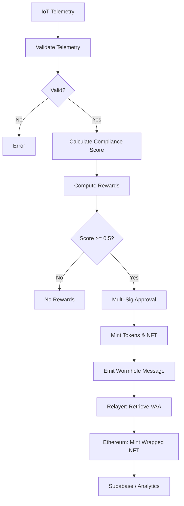

# Polymers Protocol Rewards System

**⚠️ Disclaimer: Sample / Untested Implementation**  
This is a demo AI-driven rewards platform on Solana. The code, including AI compliance scoring, token/NFT minting, Wormhole cross-chain bridging, and optimizations, is illustrative and **untested**. Do not deploy on mainnet without thorough testing, validation, and professional security audits. Use at your own risk.

## Overview

Polymers Protocol is a multi-tenant, AI-driven Solana program for minting **PLY**, **CARB**, **EWASTE** tokens, and **ESG NFTs** based on IoT telemetry and ESG metrics. It features:
- **AI-Driven Compliance Scoring**: Evaluates telemetry (e.g., contamination, temperature) and ESG metrics (e.g., carbon offset) for reward eligibility.
- **Multi-Tenant Support**: Partner-specific multipliers and thresholds.
- **Multi-Sig Governance**: Requires ≥2 admin approvals via Squads.
- **Cross-Chain Bridging**: Emits Wormhole messages for ESG NFT bridging to Ethereum, with automated relayer support.
- **Real-Time Analytics**: Logs to Supabase for Grafana dashboards.
- **Optimizations**: Fixed-point arithmetic, reduced account usage, and batched CPIs to minimize compute units (CUs).

---

## Directory Structure

```
/programs/src
├── lib.rs              # Program entry point
├── errors.rs           # Custom errors (InvalidTelemetry, LowComplianceScore)
├── state.rs            # Structs (RewardVault, BatchDeposit, EsgMetrics)
├── instructions/
│   ├── mod.rs
│   ├── initialize.rs   # Initializes RewardVault
│   ├── approve_mint.rs # Multi-sig approvals
│   ├── mint_rewards.rs # Mints PLY, CARB, EWASTE
│   └── mint_nft.rs     # Mints ESG NFTs, emits Wormhole messages
/tests
├── integration.rs      # Anchor tests
/api
├── rewards
│   └── deposit.js      # Telemetry submission endpoint
/relayer
├── relayer.ts          # Wormhole relayer for VAA automation
├── test.ts             # End-to-end test script
/Anchor.toml
/Cargo.toml
/.env
/README.md
```

---

## Features

- **AI Compliance Scoring**: Validates telemetry and computes scores using fixed-point math for efficiency (~3,000 CUs vs. ~10,000).
- **Token Minting**: Mints PLY, CARB, EWASTE based on compliance scores and partner multipliers.
- **ESG NFT Bridging**: Mints NFTs on Solana (Metaplex) and emits optimized Wormhole payloads for Ethereum bridging (~8,000 CUs).
- **Multi-Sig Governance**: Squads-based approvals, optimized for batch processing.
- **Analytics**: Supabase logs for Grafana visualization.
- **Optimizations**: Fixed-point arithmetic, bitwise validation, reduced accounts, and batched CPIs to stay under 1.4M CU limit.

---

## Prerequisites

- **Rust**: ≥1.68
- **Solana CLI**: ≥1.18
- **Anchor CLI**: ≥0.30
- **Node.js**: ≥18
- **Hardhat**: For Ethereum contract deployment
- **Wormhole SDK**: For relayer and bridging
- **Supabase CLI**: For analytics

Install:
```bash
curl --proto '=https' --tlsv1.2 -sSf https://sh.rustup.rs | sh
solana-install init 1.18.0
cargo install --git https://github.com/coral-xyz/anchor anchor-cli --locked
npm install -g @supabase/supabase-js hardhat yarn
yarn add @wormhole-foundation/sdk ethers axios typescript ts-node
```

---

## Environment Setup

1. **Clone Repository**:
   ```bash
   git clone https://github.com/your-repo/polymers-rewards.git
   cd polymers-rewards
   yarn install
   ```

2. **Configure `.env`**:
   ```bash
   SOLANA_WALLET='[wallet_keypair]'
   PROGRAM_ID='YourProgramIdHere'
   WORMHOLE_PROGRAM='worm2ZoG2kUd4vFXhvjh5UUAA9nV4fV3nq3b3U8f8'
   PLY_MINT='[ply_mint_address]'
   CARB_MINT='[carb_mint_address]'
   EWASTE_MINT='[ewaste_mint_address]'
   NFT_MINT='[nft_mint_address]'
   ETHEREUM_WORMHOLE='0x98f3c9e6E3fAce36bAAd05FE09d375Ef1464288B'
   ETHEREUM_RPC='https://sepolia.infura.io/v3/YOUR_INFURA_KEY'
   WALLET_PRIVATE_KEY='your_ethereum_wallet_private_key'
   GUARDIAN_RPC='https://guardian-mainnet.wormhole.com'
   SUPABASE_URL='[supabase_url]'
   SUPABASE_KEY='[supabase_key]'
   API_URL='http://localhost:3000/api/rewards/deposit'
   ```

3. **Preflight Checks**:
   ```bash
   solana config get
   solana balance
   anchor --version
   node -v
   npx hardhat --version
   ```

---

## Solana Deployment

1. **Build Program**:
   ```bash
   anchor build
   ```

2. **Start Local Validator** (for testing):
   ```bash
   solana-test-validator &
   ```

3. **Deploy to Devnet**:
   ```bash
   anchor deploy --provider.cluster devnet
   anchor idl init --filepath target/idl/polymers_rewards.json $PROGRAM_ID --provider.cluster devnet
   ```

4. **Initialize Reward Vault**:
   ```bash
   anchor run initialize --args reward_amount:1000
   ```

---

## Ethereum Deployment (Wormhole)

Deploy `WrappedEsgNFT.sol`:
```javascript
// scripts/deploy.js
const { ethers } = require("hardhat");

async function main() {
  const WrappedEsgNFT = await ethers.getContractFactory("WrappedEsgNFT");
  const contract = await WrappedEsgNFT.deploy(process.env.ETHEREUM_WORMHOLE);
  await contract.deployed();
  console.log("WrappedEsgNFT deployed to:", contract.address);
}

main();
```
Run:
```bash
npx hardhat run scripts/deploy.js --network sepolia
```

Verify:
```bash
npx hardhat console --network sepolia
> const contract = await ethers.getContractAt("WrappedEsgNFT", "DEPLOYED_ADDRESS")
```

---

## AI Compliance Scoring & Rewards

### Telemetry Validation
Optimized with bitwise flags to reduce CUs (~2,000 vs. ~5,000):
```rust
fn validate_telemetry(deposit: &BatchDeposit) -> Result<(), CustomError> {
    let mut flags: u8 = 0;
    flags |= if deposit.amount > 0 && deposit.amount <= 1_000_000 { 0 } else { 1 << 0 };
    flags |= if deposit.contamination <= deposit.contamination_threshold { 0 } else { 1 << 1 };
    // ... other fields
    match flags {
        0 => Ok(()),
        1 => Err(CustomError::InvalidAmount),
        _ => Err(CustomError::InvalidTelemetry),
    }
}
```

### Compliance Score Calculation
Uses fixed-point arithmetic (~3,000 CUs):
```rust
fn calculate_compliance_score(deposit: &BatchDeposit) -> u64 {
    const SCALE: u64 = 1_000_000;
    const W_CONTAMINATION: u64 = 200_000;
    // ... other weights
    let c_score = if deposit.contamination <= deposit.contamination_threshold { SCALE } else { 0 };
    // ... other scores
    (W_CONTAMINATION * c_score + /* ... */) / SCALE
}
```

### Reward Calculation
Fixed-point math for efficiency (~2,000 CUs):
```rust
fn calculate_rewards(deposit: &BatchDeposit, compliance_score: u64) -> (u64, u64, u64) {
    const SCALE: u64 = 1_000_000;
    let ply = (deposit.amount * 10 * SCALE * deposit.ply_multiplier * compliance_score) / (SCALE * SCALE);
    // ... carb, ewaste
    (ply, carb, ewaste)
}
```

### NFT Bridging
Optimized Wormhole payload (~8,000 CUs):
```rust
fn emit_wormhole_message<'info>(ctx: &Context<MintEsgNft>, nft_mint: Pubkey, target_chain: u16, recipient: [u8;32], esg_metrics: &EsgMetrics, compliance_score: u64) -> Result<(), CustomError> {
    let mut payload = [0u8; 82];
    payload[0..2].copy_from_slice(&[0u8, 1u8]);
    payload[2..34].copy_from_slice(&nft_mint.to_bytes());
    payload[34..66].copy_from_slice(&recipient);
    payload[66..74].copy_from_slice(&esg_metrics.carbon_offset.to_le_bytes());
    payload[74..82].copy_from_slice(&esg_metrics.recyclability.to_le_bytes());
    wormhole::cpi::publish_message(CpiContext::new(ctx.accounts.wormhole_program.to_account_info(), /* ... */), 1, payload)?;
    Ok(())
}
```

---

## Example Inputs

**Telemetry**:
```json
{
  "amount": 1000,
  "contamination": 5,
  "temperature": 25,
  "carbon_offset": 50,
  "recyclability": 80
}
```

**NFT Minting**:
```json
{
  "target_chain": 2,
  "recipient": "0xAbc1234567890123456789012345678901234567",
  "metadata_uri": "https://example.com/nft_metadata.json"
}
```

---

## Testing

1. **Local Validator**:
   ```bash
   solana-test-validator &
   ```

2. **Anchor Tests**:
   ```bash
   anchor test
   ```

3. **Scenarios**:
   - Vault initialization
   - Telemetry validation (valid: `amount: 1000`; invalid: `amount: 2_000_000`)
   - Compliance scoring (e.g., score ≥500_000)
   - Token minting (PLY, CARB, EWASTE)
   - NFT minting & Wormhole emission
   - Multi-sig approvals (test <2 approvals failure)
   - CU usage: `solana logs | grep "consumed"`

4. **Cross-Chain**:
   - Mint NFT on Solana devnet.
   - Retrieve VAA: `curl https://wormhole.com/api/v1/vaa?source_chain=solana&mint=NFT_MINT`
   - Submit to Sepolia: Verify wrapped NFT on Etherscan.

---

## Wormhole Relayer Setup

Automates VAA delivery for ESG NFT bridging.

1. **Setup**:
   ```bash
   cd relayer
   yarn install
   ```

2. **Run Relayer**:
   ```bash
   yarn start
   ```

3. **Relayer Code** (`relayer.ts`):
   ```typescript
   import { Wormhole, ChainName } from '@wormhole-foundation/sdk';
   import { ethers } from 'ethers';
   import axios from 'axios';
   import { createClient } from '@supabase/supabase-js';

   const supabase = createClient(process.env.SUPABASE_URL!, process.env.SUPABASE_KEY!);
   const wormhole = await Wormhole.connect({ /* ... */ });

   async function runEndToEndWorkflow(recipient: string) {
       const depositId = await axios.post(process.env.API_URL!, { amount: 1000, contamination: 5, /* ... */ });
       const mint = await triggerNftMint(depositId.data.deposit_id, recipient);
       const vaa = await retrieveVaa(mint);
       const txHash = await submitVaaToEthereum(vaa);
       await supabase.from('nft_bridges').insert({ tx_hash: txHash });
   }
   ```

4. **Test**:
   ```bash
   yarn test
   ```

---

## Automated End-to-End Workflow

```bash
# Submit telemetry
node ./api/rewards/deposit.js --amount 1000 --contamination 5 --temperature 25 --carbon_offset 50 --recyclability 80

# Mint NFT
anchor run mint_nft --args target_chain:2 recipient:0xAbc123 metadata_uri:https://example.com/nft_metadata.json

# Run relayer
cd relayer && yarn start
```

---

## Workflow Diagram



---

## Optimizations

- **Compute Units**: Reduced by ~15,000–50,000 CUs using fixed-point math, bitwise validation, and batched CPIs.
- **Accounts**: Minimized with PDAs and read-only accounts (~2,000 CUs saved).
- **Wormhole**: Fixed-size payloads (~2,000 CUs saved).
- **Off-Chain**: Precompute telemetry validation in `/api/rewards/deposit`.

---

## Security Considerations

- Audit for overflow in fixed-point math.
- Validate PDAs and Wormhole payloads.
- Ensure multi-sig enforces ≥2 approvals.
- Monitor Wormhole Guardian risks (e.g., past $320M exploit).<grok:render type="render_inline_citation"><argument name="citation_id">15</argument></grok:render>
- Log errors to Supabase/Sentry.

---

## Future Enhancements

- **TensorFlow.js**: Anomaly detection for telemetry fraud.
- **Wormhole SDK**: Full relayer automation with batching.
- **Grafana**: Visualize compliance scores and bridging metrics.
- **Versioned Transactions**: Optimize Solana fees.
- **Audits**: Engage Trail of Bits for mainnet readiness.

---

## Contributing

1. Fork and clone.
2. Create branch: `git checkout -b feature/your-feature`.
3. Commit and push.
4. Open pull request.

Contact: `support@polymersprotocol.com`.

---

## License

MIT License (demo only). Do not deploy without testing and audits.
